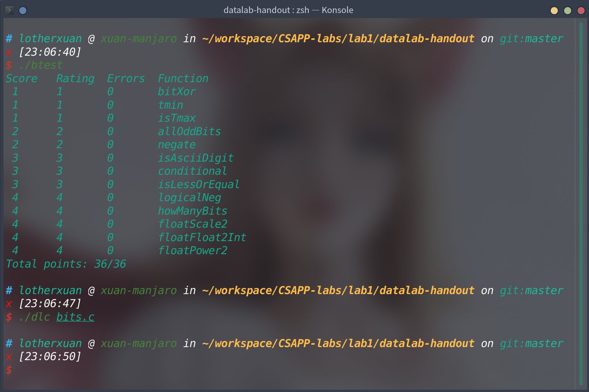

## Lab1实验记录

  简要介绍实验要求如下：实验要求在一定限制条件下完成源文件中bits.c的一系列函数的实现。该实验主要考察了对补码表示法，浮点数表示法的理解和底层实现。


### 函数 *bitXor()*

函数实现要求和函数签名如下：

```c
/*
 * bitXor - x^y using only ~ and &
 *   Example: bitXor(4, 5) = 1
 *   Legal ops: ~ &
 *   Max ops: 14
 *   Rating: 1
 */
int bitXor(int x, int y) {
  return 2;
}
```

> 该函数要求实现异或操作。

简要分析可以很容易理解，实际上实现该函数用到的是离散数学和数字逻辑电路的知识。其本质是通过与门和非门实现异或门。将异或运算符通过逻辑运算符表示如下：

${\displaystyle p\oplus q= (\lnot(p\land q)\land \lnot(\lnot p\land \lnot q))}$

通过上式我们可以实现函数。

代码如下：

```c
int bitXor(int x, int y) {
  int res = (~(x & y)) & (~((~x) & (~y)));
  return res;
}
```


### 函数 *tmin()*

函数实现要求和函数签名如下：

```c
/*
 * tmin - return minimum two's complement integer
 *   Legal ops: ! ~ & ^ | + << >>
 *   Max ops: 4
 *   Rating: 1
 */
int tmin(void) { return 2; }
```

> 该函数要求得到32位补码表示下的最小值。

该值用二进制表示即为100..0,即最高位为1,其他为全0。故将常数1左移31位即可实现。

代码如下：

```c
int tmin(void) { return 1 << 31; }
```


### 函数 *isTmax()*

函数实现要求和函数签名如下：

```c
/*
 * isTmax - returns 1 if x is the maximum, two's complement number,
 *     and 0 otherwise
 *   Legal ops: ! ~ & ^ | +
 *   Max ops: 10
 *   Rating: 1
 */
int isTmax(int x) { return 2; }
```

> 该函数判断一个数是否为32位补码表示法的最大数。

该值用二进制表示即为000..1,即最低位为1,其他为全0。考虑到该值的二进制形式和上题存在对称结构。我们可以考虑如下做法：将x按位取反，再通过将x的值加1得到32位补码表示法中的最小值，再将两者做异或操作（即判断两数是否相等），最后排除0xffffffff的特殊情况。其中4,6两行为排除特殊情况的代码。

代码如下：

```c
int isTmax(int x) {
  int res = !((~x) ^ (x + 1));
  // x为0xffffffff或0x7fffffff的时候,res为1，其他时候为0
  int check_full_f = !(~x);
  // x为0xffffffff的时候check_full_f为1,其他为0
  res = (res & 1) & (!check_full_f & 1);
  return res;
}
```


### 函数 *allOddBits()*

函数实现要求和函数签名如下：

```c
/*
 * allOddBits - return 1 if all odd-numbered bits in word set to 1
 *   where bits are numbered from 0 (least significant) to 31 (most significant)
 *   Examples allOddBits(0xFFFFFFFD) = 0, allOddBits(0xAAAAAAAA) = 1
 *   Legal ops: ! ~ & ^ | + << >>
 *   Max ops: 12
 *   Rating: 2
 */
int allOddBits(int x) { return 2; }
```

> 该函数判断一个数的二进制表示中是否所有奇数位均为1。

实现该函数关键在于构造出一个结构为1010...10的二进制数作为掩码。利用该数和x的与操作可以将所有偶数位置0,并保留x奇数位的数，再将与操作的结果和掩码进行异或操作即可达成要求。

代码如下：

```c
int allOddBits(int x) {
  int mask = 0xAA;
  mask = (0xAA << 8) + mask;
  mask = (mask << 16) + mask;

  return !((x & mask) ^ mask);
}
```


### 函数 *negate()*

函数实现要求和函数签名如下：

```c
/*
 * negate - return -x
 *   Example: negate(1) = -1.
 *   Legal ops: ! ~ & ^ | + << >>
 *   Max ops: 5
 *   Rating: 2
 */
int negate(int x) { return 2; }
```

> 该函数要求实现取负值的操作。

利用补码表示法中取反加1即可实现要求。

代码如下：

```c
int negate(int x) { return ~x + 1; }
```


### 函数 *isAsciiDigit()*

函数实现要求和函数签名如下：

```c
/*
 * isAsciiDigit - return 1 if 0x30 <= x <= 0x39 (ASCII codes for characters '0'
 * to '9') Example: isAsciiDigit(0x35) = 1. isAsciiDigit(0x3a) = 0.
 *            isAsciiDigit(0x05) = 0.
 *   Legal ops: ! ~ & ^ | + << >>
 *   Max ops: 15
 *   Rating: 3
 */
int isAsciiDigit(int x) { return 2; }
/*
 * conditional - same as x ? y : z
 *   Example: conditional(2,4,5) = 4
 *   Legal ops: ! ~ & ^ | + << >>
 *   Max ops: 16
 *   Rating: 3
 */
```

> 该函数要求判断x是否是ascii数字字符。

实现该函数的思路主要是通过x和0x30和0x3a的大小关系来判断关系式*0x30 <= x <= 0x39*是否成立。由于题目限制不允许使用减号，所以利用了补码表示法中取反加1间接实现减法。然后通过检查计算结果的符号位来判断相对大小关系。

代码如下：

```CQL
int isAsciiDigit(int x) {
  int sign = 1 << 31;
  int lower_bound = 0x30;
  int upper_bound = 0x3a;
  int minus_lower_bound = ~lower_bound + 1;
  int minus_upper_bound = ~upper_bound + 1;
  int check_lower = !(((x + minus_lower_bound) & sign) ^ sign);
  int check_upper = !(((x + minus_upper_bound) & sign) ^ sign);
  return (!check_lower) & check_upper;
}
```


### 函数 *conditional()*

函数实现要求和函数签名如下：

```c
/*
 * conditional - same as x ? y : z
 *   Example: conditional(2,4,5) = 4
 *   Legal ops: ! ~ & ^ | + << >>
 *   Max ops: 16
 *   Rating: 3
 */
int conditional(int x, int y, int z) { return 2; }
/*
 * isLessOrEqual - if x <= y  then return 1, else return 0
 *   Example: isLessOrEqual(4,5) = 1.
 *   Legal ops: ! ~ & ^ | + << >>
 *   Max ops: 24
 *   Rating: 3
 */
```

> 该函数要求实现三元表达式。

实现该函数的主要思路是先将x转化成布尔型的变量。然后再根据x的值生成一个全1或者全0的变量。通过利用全1和全0在与其他数进行与操作中的特性来实现实验要求。

代码如下：

```c
int conditional(int x, int y, int z) {
  int select = !(!x);
  int mask = ~select + 1;
  y = y & mask;
  z = z & ~mask;
  return y | z;
}
```


### 函数 *isLessOrEqual()*

函数实现要求和函数签名如下：

```c
/*
 * isLessOrEqual - if x <= y  then return 1, else return 0
 *   Example: isLessOrEqual(4,5) = 1.
 *   Legal ops: ! ~ & ^ | + << >>
 *   Max ops: 24
 *   Rating: 3
 */
int isLessOrEqual(int x, int y) { return 2; }
```

> 该函数要求实现<=运算。

可以主要考虑函数实现的两个部分。主要思路类似函数*isAsciiDigit()*中通过相减判断大小的部分。但同是也发现函数*isAsciiDigit()*中参与运算的数值较小，不会发生溢出，但在该函数中必须考虑可能产生溢出的情形。故第一部分考虑在没有发生溢出的情形（即x,y同号），在上文中有类似实现，在此不赘述。第二部分考虑发生溢出的情形（即x,y不同号），分别考虑x符号为负且y符号为正和x符号为正且y符号为负两种情形，最后即可达成实验要求。

代码如下：

```c
int isLessOrEqual(int x, int y) {
  int sign = 1 << 31;
  int minus_result = x + (~y + 1);
  int check_all_zero = !minus_result;
  int check_lower = !((minus_result & sign) ^ sign);
  int x_sign = (x & sign) ^ sign;
  int y_sign = (y & sign) ^ sign;
  int check_x_y =
      (!x_sign) & !(!y_sign);  //检查是否为如下情形x符号为负且y符号为正

  int check_y_x =
      !(!x_sign) & !y_sign;  ////检查是否为如下情形x符号为正且y符号为负
  return (check_all_zero | check_lower | check_x_y) & !check_y_x;
}
```


### 函数 *logicalNeg()*

函数实现要求和函数签名如下：

```c
/*
 * logicalNeg - implement the ! operator, using all of
 *              the legal operators except !
 *   Examples: logicalNeg(3) = 0, logicalNeg(0) = 1
 *   Legal ops: ~ & ^ | + << >>
 *   Max ops: 12
 *   Rating: 4
 */
int logicalNeg(int x) { return 2; }
```

> 该函数要求实现！运算符。

感觉实现思路比较奇怪。原理如下：主要根据符号位来判断。对于一个非零的数来说，它的符号位和它的负数的符号位一定有一个是1,而对于零来说两者均为0;

代码如下：

```c
int logicalNeg(int x) {
  int negetive_x = ~x + 1;
  int check_if_positive = ~(negetive_x >> 31) + 1;
  int check_if_negetive = ~(x >> 31) + 1;
  return (check_if_negetive | check_if_positive) ^ 1;
}
```


### 函数 *howManyBits()*

函数实现要求和函数签名如下：

```c
/* howManyBits - return the minimum number of bits required to represent x in
 *             two's complement
 *  Examples: howManyBits(12) = 5
 *            howManyBits(298) = 10
 *            howManyBits(-5) = 4
 *            howManyBits(0)  = 1
 *            howManyBits(-1) = 1
 *            howManyBits(0x80000000) = 32
 *  Legal ops: ! ~ & ^ | + << >>
 *  Max ops: 90
 *  Rating: 4
 */
int howManyBits(int x) { return 0; }
```

> 该函数要求返回表示x的最小位数。

主要思路如下：对于正数，只需要该数的位数+1（符号位）。对于负数，只需要找到最高位为0的地方。

实现如下：

```c
int howManyBits(int x) {
  int b16, b8, b4, b2, b1, b0;
  int sign = x >> 31;
  x = (sign & ~x) |
      (~sign &
       x);  

  // 不断缩小范围
  b16 = !!(x >> 16) << 4;  
  x = x >> b16;  
  b8 = !!(x >> 8) << 3;  
  x = x >> b8;           
  b4 = !!(x >> 4) << 2;  
  x = x >> b4;
  b2 = !!(x >> 2) << 1;
  x = x >> b2;
  b1 = !!(x >> 1);
  x = x >> b1;
  b0 = x;
  return b16 + b8 + b4 + b2 + b1 + b0 + 1;
}  
```


### 函数 *floatScale2()*

函数实现要求和函数签名如下：

```c
/*
 * floatScale2 - Return bit-level equivalent of expression 2*f for
 *   floating point argument f.
 *   Both the argument and result are passed as unsigned int's, but
 *   they are to be interpreted as the bit-level representation of
 *   single-precision floating point values.
 *   When argument is NaN, return argument
 *   Legal ops: Any integer/unsigned operations incl. ||, &&. also if, while
 *   Max ops: 30
 *   Rating: 4
 */
unsigned floatScale2(unsigned uf) { return 2; }
```

> 该函数要求实现在二进制层面上将浮点数乘2

首先考虑一般情况（即exponent不是全0或者全1），此时情况较为简单，将exponent域加1即可。当为全1时直接返回uf即可。当为全0时考虑是否产生进位即可。

代码如下：

```c
unsigned floatScale2(unsigned uf) {
  unsigned res;
  unsigned sign = uf >> 31;
  unsigned exponent = (uf << 1) >> 24;
  unsigned significand = (uf << 9) >> 9;
  if (!(exponent ^ 0)) {
    if (significand >> 22) {
      res = ((significand << 10) >> 9) + (((sign << 8) + exponent + 1) << 23);

    } else {
      res = ((significand << 10) >> 9) + (((sign << 8) + exponent) << 23);
    }

  } else if (!(exponent ^ 0xff)) {
    res = uf;
  } else {
    exponent = exponent + 1;
    res = significand + (((sign << 8) + exponent) << 23);
  }

  return res;
}
```


### 函数 *floatFloat2Int()*

函数实现要求和函数签名如下：

```c
/*
 * floatFloat2Int - Return bit-level equivalent of expression (int) f
 *   for floating point argument f.
 *   Argument is passed as unsigned int, but
 *   it is to be interpreted as the bit-level representation of a
 *   single-precision floating point value.
 *   Anything out of range (including NaN and infinity) should return
 *   0x80000000u.
 *   Legal ops: Any integer/unsigned operations incl. ||, &&. also if, while
 *   Max ops: 30
 *   Rating: 4
 */
int floatFloat2Int(unsigned uf) { return 2; }
```

> 该函数要求将浮点数转换为整数。

首先我们可以发现int类型表示的范围在float表示的范围中只占很少一部分，大部分的浮点数在转换的过程中都会发生溢出或者舍入。故我们对于浮点数的exponent域进行讨论。在讨论的过程中主要要注意的是significand域，在转换到浮点数的过程中要同时考虑隐藏的前导1和浮点数表示中的符号位。

代码如下：

```c
int floatFloat2Int(unsigned uf) {
  int res;
  int sign = uf >> 31;
  int exponent = ((uf & 0x7f800000) >> 23) - 127;
  int significand = (uf & 0x007fffff) | 0x00800000;
  if (exponent > 31 || !(exponent ^ 31)) {
    res = 0x80000000u;
  } else if (exponent < 0) {
    res = 0;
  } else if (!(exponent ^ 0)) {
    if (sign) {
      res = -1;
    } else {
      res = 1;
    }
  } else {
    if (sign) {
      significand = ~(significand + 0x800000) + 1;
    } else {
      significand = significand + 0x800000;
    }
    if (exponent > 23 || !(exponent ^ 23)) {
      res = significand << (exponent - 23);
    } else if (exponent < 23) {
      res = significand >> (23 - exponent);
    }
  }
  return res;
}
```


### 函数 *floatPower2()*

函数实现要求和函数签名如下：

```c
/*
 * floatPower2 - Return bit-level equivalent of the expression 2.0^x
 *   (2.0 raised to the power x) for any 32-bit integer x.
 *
 *   The unsigned value that is returned should have the identical bit
 *   representation as the single-precision floating-point number 2.0^x.
 *   If the result is too small to be represented as a denorm, return
 *   0. If too large, return +INF.
 *
 *   Legal ops: Any integer/unsigned operations incl. ||, &&. Also if, while
 *   Max ops: 30
 *   Rating: 4
 */
unsigned floatPower2(int x) { return 2; }
```

> 该函数要求将2的整数次幂转换为浮点数。

该函数实现较为简单。大概只需要完成x到exponent域的值的转换即可。

代码如下：

```c
unsigned floatPower2(int x) {
  int res;
  int sign = 0 << 31;
  int exponent;
  if (x > 127) {
    exponent = 0xff << 23;
    res = sign + exponent;
  } else if (x < -126) {
    res = 0;
  } else {
    exponent = (x + 127) << 23;
    res = sign + exponent;
  }
  return res;
}
```


### 完成截图如下

