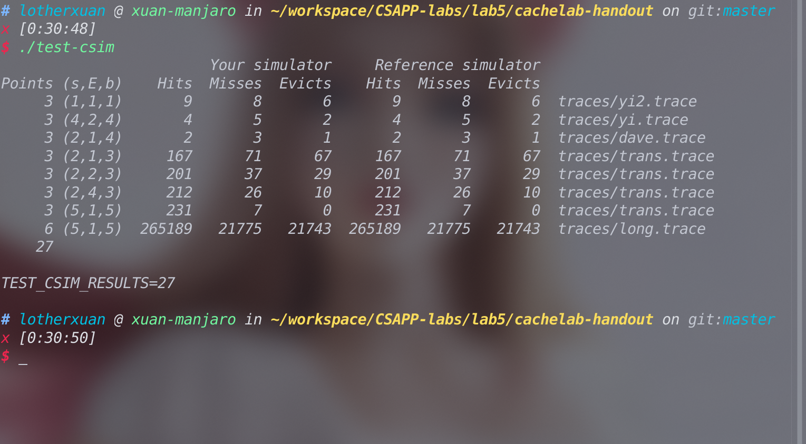

## Lab5实验记录

简要介绍实验如下，实验分为两个部分,第一个部分要求我们模拟一个cache，第二个部分要求我们尽量利用局部性原理优化一个矩阵转置函数。

### Part A

在PartA中我们需要在给定cache的s,E,b的参数的情况下，实现一个LRU策略的cache。

在一开始我们面对实现一个cache可能会觉得存在诸多困难，但仔细阅读[实验手册](http://csapp.cs.cmu.edu/3e/cachelab.pdf)后我们是能发现实验简化了很多条件，比如说只设置了三种操作类型L,S,M。比如说假设每次操作中的内存地址是对齐的，从而使我们能完全不用官每次操作中的块大小。

实验中我们考虑的第一个问题就是把命令行参数传递到我们的程序中。考虑到这个命令行参数是有比较强烈的格式风格的，也就是linux风格，我们可以使用C语言的库`<getopt.h>`来提供对命令行参数的处理。

接下来我们考虑这样一个问题，在读取的`trace`文件中的每一行中的地址中获取到标记，组索引和块偏移的值。由于这三个值在内存的二进制表示上是连续分布的，所以我们可以考虑使用C语言的位操作来获取到这些值。我的思路主要是分别通过移位操作来分别构造出对应于这三个值的掩码，下面记录一个在构造掩码的过程中遇到的bug，和C语言中类型占的位有关。

首先考虑这样一个情况：

```c
long l=1<<32;
```

编译器会报错`警告：左移次数大于或等于类型宽度 [-Wshift-count-overflow]`。

但如果我们确认`sizeof(long)`的值为8,并且`CHAR_BIT`的值也为8时，我们可以确保该环境下long的长度为64,但仍然出现了编译器警告。

原因我们进行移位的1仍然是`int`类型，而绝大多数情况下`int`类型都占32位，所以会发生移位溢出。关于该问题的详细解释可见该问题[warning: left shift count >= width of type](https://stackoverflow.com/questions/4201301/warning-left-shift-count-width-of-type)

故代码应该改为

```c
long l=1L<<32;
```

关于C语言中类型所占的位数额外补充一些：

在C\C++中，**一字节未必是8bits**。

根据C++标准，除了**char必然是1byte**之外，其它都是实现定义的。甚至包括**1 byte是多少bits都是实现定义**的。

对于某一个类型的具体宽度应该这样计算：`sizeof(long long)*CHAR_BIT`

普通情况下，在**大众常见的主流pc跟手机架构中，int长度都是稳定的32位。并不是变长**。

反倒对于**long**这个类型，**在现存主流的某些架构中是32位，某些架构是64位**，这会特别麻烦。个人建议是永远**不要**使用**long**这个类型。只使用 int32，int64这样的。

换句话说，byte，short，int 基本上可以认为是8，16，32位，而64位建议使用 int64_t 这样的类型，不要使用long或者long long。

以上来自知乎回答：https://www.zhihu.com/question/376447390/answer/1066440989

稍微总结一下的话就是

涉及到长度敏感的，使用

```c
#include <stdint.h>
```

然后用 uint32_t 这类显式别名。

最后一个比较重要的问题是LRU算法的实现。

一般来说有很多LRU算法的实现方法，其中比较优秀的一种实现方法是用哈希表+链表，这种实现方法下无论是查询还是插入的时间复杂度都是O(1)，在leetcode的第146题中我完成了这种实现，[详情见此处](https://github.com/Lotherxuan/leetcode-record/blob/master/146.lru%E7%BC%93%E5%AD%98%E6%9C%BA%E5%88%B6.cpp)

由于C语言没有像C++标准库那样提供现成的哈希表和链表，所以我采取了比较简略的LRU算法的实现方法，自己实现一个单向链表的数据结构，然后只使用单向链表来实现LRU算法，这样实现虽然极大减少了代码的复杂度，但增加了操作的时间复杂度。

#### 完成截图



### Part B

主要讲讲实验思路和一些注意事项。

具体的解体过程只能提供代码作为参考了...该part中三个小问都会存在一些奇奇怪怪的cache优化方法，需要大量的图片和讲解才能说明白，而我比较懒不想画图，所以就只能传递一些解题思想了。

首先我们由实验的调试以及相关问题说开来。

