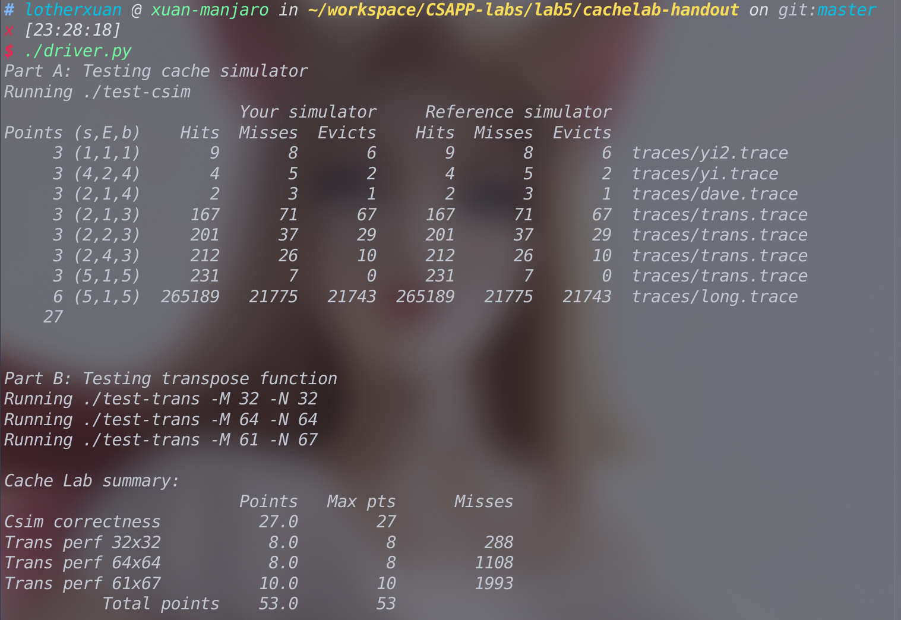

## Lab5实验记录

简要介绍实验如下，实验分为两个部分,第一个部分要求我们模拟一个cache，第二个部分要求我们尽量利用局部性原理优化一个矩阵转置函数。

### Part A

在PartA中我们需要在给定cache的s,E,b的参数的情况下，实现一个LRU策略的cache。

在一开始我们面对实现一个cache可能会觉得存在诸多困难，但仔细阅读[实验手册](http://csapp.cs.cmu.edu/3e/cachelab.pdf)后我们是能发现实验简化了很多条件，比如说只设置了三种操作类型L,S,M。比如说假设每次操作中的内存地址是对齐的，从而使我们能完全不用官每次操作中的块大小。

实验中我们考虑的第一个问题就是把命令行参数传递到我们的程序中。考虑到这个命令行参数是有比较强烈的格式风格的，也就是linux风格，我们可以使用C语言的库`<getopt.h>`来提供对命令行参数的处理。

接下来我们考虑这样一个问题，在读取的`trace`文件中的每一行中的地址中获取到标记，组索引和块偏移的值。由于这三个值在内存的二进制表示上是连续分布的，所以我们可以考虑使用C语言的位操作来获取到这些值。我的思路主要是分别通过移位操作来分别构造出对应于这三个值的掩码，下面记录一个在构造掩码的过程中遇到的bug，和C语言中类型占的位有关。

首先考虑这样一个情况：

```c
long l=1<<32;
```

编译器会报错`警告：左移次数大于或等于类型宽度 [-Wshift-count-overflow]`。

但如果我们确认`sizeof(long)`的值为8,并且`CHAR_BIT`的值也为8时，我们可以确保该环境下long的长度为64,但仍然出现了编译器警告。

原因我们进行移位的1仍然是`int`类型，而绝大多数情况下`int`类型都占32位，所以会发生移位溢出。关于该问题的详细解释可见该问题[warning: left shift count >= width of type](https://stackoverflow.com/questions/4201301/warning-left-shift-count-width-of-type)

故代码应该改为

```c
long l=1L<<32;
```

关于C语言中类型所占的位数额外补充一些：

在C\C++中，**一字节未必是8bits**。

根据C++标准，除了**char必然是1byte**之外，其它都是实现定义的。甚至包括**1 byte是多少bits都是实现定义**的。

对于某一个类型的具体宽度应该这样计算：`sizeof(long long)*CHAR_BIT`

普通情况下，在**大众常见的主流pc跟手机架构中，int长度都是稳定的32位。并不是变长**。

反倒对于**long**这个类型，**在现存主流的某些架构中是32位，某些架构是64位**，这会特别麻烦。个人建议是永远**不要**使用**long**这个类型。只使用 int32，int64这样的。

换句话说，byte，short，int 基本上可以认为是8，16，32位，而64位建议使用 int64_t 这样的类型，不要使用long或者long long。

以上来自知乎回答：https://www.zhihu.com/question/376447390/answer/1066440989

稍微总结一下的话就是

涉及到长度敏感的，使用

```c
#include <stdint.h>
```

然后用 uint32_t 这类显式别名。

最后一个比较重要的问题是LRU算法的实现。

一般来说有很多LRU算法的实现方法，其中比较优秀的一种实现方法是用哈希表+链表，这种实现方法下无论是查询还是插入的时间复杂度都是O(1)，在leetcode的第146题中我完成了这种实现，[详情见此处](https://github.com/Lotherxuan/leetcode-record/blob/master/146.lru%E7%BC%93%E5%AD%98%E6%9C%BA%E5%88%B6.cpp)

由于C语言没有像C++标准库那样提供现成的哈希表和链表，所以我采取了比较简略的LRU算法的实现方法，自己实现一个单向链表的数据结构，然后只使用单向链表来实现LRU算法，这样实现虽然极大减少了代码的复杂度，但增加了操作的时间复杂度。

#### 完成截图


### Part B

主要讲讲实验思路和一些注意事项。

具体的解体过程只能提供代码作为参考了...该part中三个小问都会存在一些奇奇怪怪的cache优化方法，需要大量的图片和讲解才能说明白，而我比较懒不想画图，所以就只能传递一些解题思想了。

首先我们由实验的调试以及相关问题说开来。

在[实验手册](http://csapp.cs.cmu.edu/3e/cachelab.pdf)的*6.2 Working on Part B*中我们可以知道测试矩阵转置函数的程序是会在测试的过程中生成一份内存访问的日志文件的，我们是可以使用Part A中我们自己写的`csim.c`程序来读取该日志文件并模拟内存访问的过程的，笔者是建议在自己的`csim.c`的verbose模式中不仅输出cache的访问是否miss,同时输出由内存地址生成的标志位和索引位，在后面我们优化矩阵转置函数的cache友好度时有比较重要的左右。

```c
    uint64_t mark = (mark_mask & address) >> (s + b);
    uint64_t index = (index_mask & address) >> b;
    if (verbose) {
       printf("%lx L index:%d mark:%d misses evictions\n", address, index,mark);
          }
```

上面为输出格式的举例，详细的代码可见目录下的`csim-test.c`。编译命令可以参考`Makefile`文件中的编译命令。

接着我们讲讲为什么要输出标志位和索引位。

首先我们看看提供的矩阵形状和数据类型，这是一个int类型的数组，每个int类型数据占4字节，对于二维数组我们关注前一个维度，到这个lab应该已经比较熟悉C语言的二维数组的内存分布，行主序的数组结构会影响我们在纵向遍历数组时访问数组的地址递增大小。

另一方面就是提供的cache参数，由b=5可以知道一个块里面有8个int，由s=5可以知道一共有32个组，而E=1则是最重要的参数，表明了这个cache是直接映射的，也就是每个组中只有一个块，这导致一个很重要的问题，就是即使整个cache的大小能存放下我们的工作集，但仍有可能发生驱逐的现象。如下图


可以看到第一段的最后，数组A和B映射到了同一个cache组中，造成了页面驱逐。这个在优化中非常关键，而发现这个现象必须要观察到索引位才行，所以才会有上文的建议。

下面讲讲比较重要的一些优化思路。

**第一个是分块。**

分块的大致思想是将一个程序中的数据结构组织成大的片，称为块，使得能够将一个片加载到L1高速缓存中，并在这个片中进行所需的所有的读和写，然后丢弃掉这个片，依次类推。分块策略能很好的提高循环的时间局部性，这是第一个也是最重要的一个优化策略。

我们能准确计算出cache所能容纳的最大工作集大小，从而设置一个大小比较合适的较小的矩阵作为块。但不要忘了我们的cache是采用直接映射的策略，所以具体的miss情况还会取决于二维数组A的第一个维度的参数，所以具体对于不同形状的矩阵应该设置多大的块需要我们自己去试验。

**第二个是对角线元素最后进行转置。**

这个优化策略具有很强的针对性，只适用于特定形状的二维数组。其主要目的是解决下面一种情况：


假设这在一个4*4的块中，理想情况下一旦A\[0\]\[0\]加载到cache中，在整个遍历块的第一行时都不会被驱逐出去，也就是假设B\[0\]\[0\]~B\[4\]\[0\]都没有和A\[0\]\[0\]映射到相同的组。但实际情况是往往B\[0\]\[0\]会和A\[0\]\[0\]映射到相同的组，这样访问A访问\[0\]\[1\]会马上产生一次miss。将A\[0\]\[0\]这样的块中的对角线元素放到最后访问能在这种情景下有效减少miss。

**第三是用局部变量保存cache中的数据。**

考虑这样一个事实，在实际代码执行中，除了在内存和cache中保存数据还可以在寄存器中保存数据。而使用到这些寄存器的就是局部变量。我们可以在cache读入一个块的时候，用局部变量保存这个块中我们暂时没有用到的数据，以便将来使用。这个思路相当于是提高了程序的时间局部性，使用局部变量人为的制造出一些使用局部性原理的场景。

第一问和第三问比较简单，只用到第一、二个优化策略就够了，但第二问比较麻烦，也是最难的一问，需要对于第三个优化策略的深刻理解和运用。坦白地说我自己并没有完全独立地把该问做到满分，经过测试，如果只用前两个优化策略，在最棒的情况下（4*4的块）也会产生1700次miss左右，距离满分1300次miss还有一定的差距。

以下一篇博客的解法非常精妙，经测试是可以拿到满分的，可以作为参考。

[https://www.jianshu.com/p/e68dd8305e9c](https://www.jianshu.com/p/e68dd8305e9c)

### 完成截图

