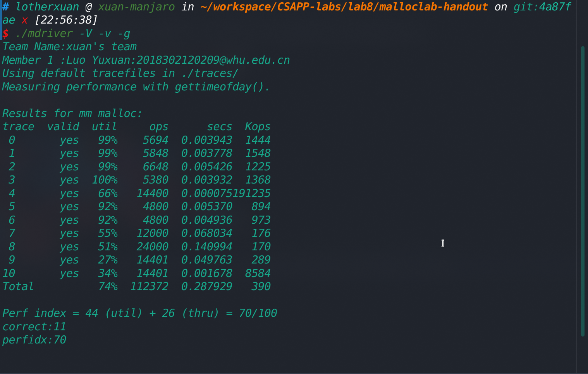

## lab8实验记录

简要介绍实验内容：实验要求我们完成一个动态内存分配器，即模拟malloc,free和realloc功能。完成实验需要我们理解内存布局，管理内存的数据结构，并在时间效率和空间效率上进行权衡取舍。

详细实验内容请见[官网](http://csapp.cs.cmu.edu/3e/labs.html)。

### 实验前期准备

#### 材料阅读

1. CSAPP第九章。首先毫无疑问是需要通读CSAPP的第9章虚拟内存，内存布局模型，分配器的要求和目标这些实验原理相关内容都包含在CSAPP第9章中。
2. 系统接口。需要了解sbrk这样直接通过系统调用获得内存的系统接口。
3. 官方提供的实验指导。实验指导[链接](http://csapp.cs.cmu.edu/3e/malloclab.pdf)在此。

#### 测试评估相关

回到实验本身上来，如果是从实验官网上直接下载的`Self-Study Handout`，那么代码框架中所提供的测试文件只有两个测试情形非常简单（测试数据量较小）的测试文件，不足以在统计学意义上评估我们设计的动态内存分配器的性能。建议下载实验[完整的测试文件](https://github.com/Ethan-Yan27/CSAPP-Labs/tree/master/yzf-malloclab-handout/traces)。

将所有测试文件都放在`traces`文件夹中，然后将`traces`文件夹放在`config.h`的同级目录中，在`config.h`中间中添加宏定义`#define TRACEDIR "./traces/"`，之后我们就可以使用`./mdriver -V -v -g`的命令来测试和评估我们设计的内存分配器。

根据CSAPP提供的框架代码，将有两个维度评估我们的内存分配器的性能，分别是空间利用率和速度。其中空间利用率主要取决于我们的分配过程中产生的内部碎片和外部碎片的大小，速度主要取决于我们的malloc和free等操作的时间复杂度，详细评估公式见[实验指导](http://csapp.cs.cmu.edu/3e/malloclab.pdf)。

### 实验分析

根据内存分配器的特点，至少有以下三个维度的特征（其他维度的特征则包括块格式,最小块大小等等）决定了内存分配器的设计：

1. 空闲列表的组织方式：

  * 隐式空闲链表(implicit free list)

  * 显式空闲链表(explicit free list)

  * 分离空闲列表(segregated free list)

2.     放置策略

  * 首次适配(fitst fit)
  * 下一次适配(next fit)
  * 最佳适配(best fit)
3. 合并策略
  * 立即合并(immediate coalescing)
  * 推迟合并(deferred coalescing)

无疑诸如块格式，最小块大小等因素在特定情形下也会极大地影响内存分配器的性能，但在接下来的实验过程中我们将主要考虑以上三个维度，分别测试不同的内存分配器的设计，以找到评分最高（同时考虑空间利用率和时间）的内存分配器。

### 实验过程

#### 隐式空闲链表，首次适配，立即合并

首先我们根据CSAPP书上的*9.9.12节*来实现一个最简单的基于隐式空闲链表的内存分配器。

```c
/* single word (4) or double word (8) alignment */
#define ALIGNMENT 8

/* rounds up to the nearest multiple of ALIGNMENT */
#define ALIGN(size) (((size) + (ALIGNMENT - 1)) & ~0x7)

#define SIZE_T_SIZE (ALIGN(sizeof(size_t)))

#define WSIZE 4
#define DSIZE 8
#define CHUNKSIZE (1 << 12) /* Extend heap by this amount (bytes) */
#define MINBLOCKSIZE 2 * DSIZE

#define MAX(x, y) ((x) > (y) ? (x) : (y))
#define PACK(size, alloc) \
  ((size) | (alloc)) /* Pack a size and allocated bit into a word */

#define GET(p) (*(unsigned int*)(p)) /* read a word at address p */
#define PUT(p, val) \
  (*(unsigned int*)(p) = (val)) /* write a word at address p */

#define GET_SIZE(p) (GET(p) & ~0x7) /* read the size field from address p */
#define GET_ALLOC(p) (GET(p) & 0x1) /* read the alloc field from address p */

/* given block ptr bp, compute address of its header */
#define HDRP(bp) ((char*)(bp)-WSIZE)
/* given block ptr bp, compute address of its footer */
#define FTRP(bp) ((char*)(bp) + GET_SIZE(HDRP(bp)) - DSIZE)

/* given block ptr bp, compute address of next blocks */
#define NEXT_BLKP(bp) ((char*)(bp) + GET_SIZE(HDRP(bp)))
/* given block ptr bp, compute address of prev blocks */
#define PREV_BLKP(bp) ((char*)(bp)-GET_SIZE((char*)(bp)-DSIZE))
```

以上为操作空闲链表的基本常数和宏

```c
static void* coalesce(void* bp) {
  size_t prev_alloc = GET_ALLOC(FTRP(PREV_BLKP(bp)));
  size_t next_alloc = GET_ALLOC(HDRP(NEXT_BLKP(bp)));
  size_t size = GET_SIZE(HDRP(bp));

  if (prev_alloc && next_alloc)
    return bp;
  else if (prev_alloc && !next_alloc) {
    size += GET_SIZE(HDRP(NEXT_BLKP(bp)));
    PUT(HDRP(bp), PACK(size, 0));
    PUT(FTRP(bp), PACK(size, 0));
  } else if (!prev_alloc && next_alloc) {
    size += GET_SIZE(HDRP(PREV_BLKP(bp)));
    PUT(FTRP(bp), PACK(size, 0));
    PUT(HDRP(PREV_BLKP(bp)), PACK(size, 0));
    bp = PREV_BLKP(bp);
  } else {
    size += GET_SIZE(HDRP(PREV_BLKP(bp))) + GET_SIZE(FTRP(NEXT_BLKP(bp)));
    PUT(HDRP(PREV_BLKP(bp)), PACK(size, 0));
    PUT(FTRP(NEXT_BLKP(bp)), PACK(size, 0));
    bp = PREV_BLKP(bp);
  }

  return bp;
}
```

以上为空闲块的合并操作，分别根据相邻的两个块是否为空闲块来进行合并操作。

```c
static void* find_fit(size_t asize) {
  char* bp;
  for (bp = heap_listp; GET_SIZE(HDRP(bp)) > 0; bp = NEXT_BLKP(bp)) {
    if (!GET_ALLOC(HDRP(bp)) && GET_SIZE(HDRP(bp)) >= asize) {
      return bp;
    }
  }
  return NULL;
}
```

以上为搜索适配空闲块的操作，采取首次适配操作。

```c
static void place(void* bp, size_t asize) {
  size_t csize = GET_SIZE(HDRP(bp));

  if ((csize - asize) >= MINBLOCKSIZE) {
    PUT(HDRP(bp), PACK(asize, 1));
    PUT(FTRP(bp), PACK(asize, 1));
    bp = NEXT_BLKP(bp);
    PUT(HDRP(bp), PACK(csize - asize, 0));
    PUT(FTRP(bp), PACK(csize - asize, 0));
  } else {
    PUT(HDRP(bp), PACK(csize, 1));
    PUT(FTRP(bp), PACK(csize, 1));
  }
}
```

以上为放置空闲块的操作。

```c
void* mm_malloc(size_t size) {
  size_t asize;       // adjusted block size
  size_t extendsize;  // amount to extend heap if no fit
  char* bp;

  if (size == 0) return NULL;

  // adjusted block size to include overhead and alignment reqs
  if (size <= DSIZE)
    asize = 2 * DSIZE;
  else
    asize = DSIZE * ((size + (DSIZE) + (DSIZE - 1)) / DSIZE);

  if ((bp = find_fit(asize)) != NULL) {
    place(bp, asize);
    return bp;
  }

  // no fit found, get more memory and place the block
  extendsize = MAX(asize, CHUNKSIZE);
  if ((bp = extend_heap(extendsize / WSIZE)) == NULL) return NULL;
  place(bp, asize);
  return bp;
}
```
以上为`mm_malloc()`函数的实现。

```c
void mm_free(void* bp) {
  size_t size = GET_SIZE(HDRP(bp));

  PUT(HDRP(bp), PACK(size, 0));
  PUT(FTRP(bp), PACK(size, 0));
  coalesce(bp);
}
```

以上为`mm_free()`函数的实现。

```c
void* mm_realloc(void* ptr, size_t size) {
  void* oldptr = ptr;
  void* newptr;
  size_t copySize;

  newptr = mm_malloc(size);
  if (newptr == NULL) return NULL;
  size = GET_SIZE(HDRP(oldptr));
  copySize = GET_SIZE(HDRP(newptr));
  if (size < copySize) copySize = size;
  memcpy(newptr, oldptr, copySize - WSIZE);
  mm_free(oldptr);
  return newptr;
}
```

以上为`mm_realloc()`,关于realloc操作可以额外关注的是，毫无疑问这个realloc方法是可以优化的，但根据我们的先验经验，隐式空闲链表并不会是最好的空闲列表的组织方式，我们可以在找到目前各个条件下的最好的内存分配器的实现方式后再进行进一步优化。

该内存分配器运行结果如下：

可以看到主要问题是空间利用率不高，产生了较多的内部和外部碎片，我们会在后面的内存分配器设计中进行进一步优化。

#### 隐式空闲链表，下一次适配，立即合并

相比首次适配，立即合并，只需修改`find_fit()`函数。

```c
/*
 * find_fit - use next fit strategy to find an empty block.
 */
static void* find_fit(size_t asize) {
  char* bp;
  char* first_search = NULL;
  for (bp = heap_listp; GET_SIZE(HDRP(bp)) > 0; bp = NEXT_BLKP(bp)) {
    if (!GET_ALLOC(HDRP(bp)) && GET_SIZE(HDRP(bp)) >= asize) {
      if (!first_search) {
        first_search = bp;
      } else {
        return bp;
      }
    }
  }
  if (first_search) {
    return first_search;
  } else {
    return NULL;
  }
}
```

#### 隐式空闲链表，最佳适配，立即合并

相比首次适配，立即合并，只需修改`find_fit()`函数。

```c
/*
 * find_fit - use best fit strategy to find an empty block.
 */
static void* find_fit(size_t asize) {
  char* bp;
  char* best = NULL;
  for (bp = heap_listp; GET_SIZE(HDRP(bp)) > 0; bp = NEXT_BLKP(bp)) {
    if (!GET_ALLOC(HDRP(bp)) && GET_SIZE(HDRP(bp)) >= asize) {
      if (!best) {
        best = bp;
      } else {
        best = (GET_SIZE(HDRP(best)) - asize) < (GET_SIZE(HDRP(bp)) - asize)
                   ? best
                   : bp;
      }
    }
  }
  return best;
}
```

#### 隐式空闲链表，首次适配，推迟合并

相比首次适配，立即合并，我们只需删除在`extend_heap()`和`mm_free()`中对`coalesce()`的引用，然后修改`malloc()`函数。我们采取如下策略，在每次malloc失败的时候遍历整个块链表，然后合并所有空闲块，合并后再次尝试执行malloc过程。

```c
void* mm_malloc(size_t size) {
  size_t asize;       // adjusted block size
  size_t extendsize;  // amount to extend heap if no fit
  char* bp;

  if (size == 0) return NULL;

  // adjusted block size to include overhead and alignment reqs
  if (size <= DSIZE)
    asize = 2 * DSIZE;
  else
    asize = DSIZE * ((size + (DSIZE) + (DSIZE - 1)) / DSIZE);

  if ((bp = find_fit(asize)) != NULL) {
    place(bp, asize);
    return bp;
  }
  // no fit found, coalesce free block first
  char* coalesce_ptr;
  for (coalesce_ptr = heap_listp; GET_SIZE(HDRP(coalesce_ptr)) > 0;
       coalesce_ptr = NEXT_BLKP(coalesce_ptr)) {
    if (!GET_ALLOC(HDRP(coalesce_ptr))) {
      coalesce(coalesce_ptr);
    }
  }
  // try to find fit after coalesce
  if ((bp = find_fit(asize)) != NULL) {
    place(bp, asize);
    return bp;
  }

  // no fit found, get more memory and place the block
  extendsize = MAX(asize, CHUNKSIZE);
  if ((bp = extend_heap(extendsize / WSIZE)) == NULL) return NULL;
  place(bp, asize);
  return bp;
}
```

其他推迟合并的情形无非是以上各种情形的组合，在此不赘述。

#### 

### 实验结果

以下的三种空闲列表的组织方式中，第一张表格对应于源文件的名字，第二张表格对应于分配器的得分，前者为空间利用率，后者为速度。

#### 隐式空闲链表

|            | 立即合并 | 推迟合并 |
| :--------: | :------: | :------: |
|  首次适配  |  mm_1.c  |  mm_4.c  |
| 下一次适配 |  mm_2.c  |  mm_5.c  |
|  最佳适配  |  mm_3.c  |  mm_6.c  |

|            | 立即合并 | 推迟合并 |
| :--------: | :------: | :------: |
|  首次适配  | 44+26=70 | 45+18=62 |
| 下一次适配 | 44+25=69 | 44+19=62 |
|  最佳适配  | 45+24=69 | 45+17=62 |

#### 显式空闲链表

|            | 立即合并 | 推迟合并 |
| :--------: | :------: | :------: |
|  首次适配  |  mm_7.c  |          |
| 下一次适配 |          |          |
|  最佳适配  |          |          |

|            | 立即合并 | 推迟合并 |
| :--------: | :------: | :------: |
|  首次适配  |          |          |
| 下一次适配 |          |          |
|  最佳适配  |          |          |
#### 分离空闲链表
|            | 立即合并 | 推迟合并 |
| :--------: | :------: | :------: |
|  首次适配  |          |          |
| 下一次适配 |          |          |
|  最佳适配  |          |          |

|            | 立即合并 | 推迟合并 |
| :--------: | :------: | :------: |
|  首次适配  |          |          |
| 下一次适配 |          |          |
|  最佳适配  |          |          |

### 结果分析

对比mm_1和mm_4：存在抖动（可能原因）

